# 双生年轮：微博舆论场中《年轮》原唱与版权争议的传播可视分析

**数据可视化课程项目 · 2026年6月**

---

## 团队成员

| 角色 | 姓名 | 专业班级 | 学号 |
|:---:|------|:---:|:---:|
| A | 平倩如 | 计科2303 | 2312190307 |
| B | 宋薇 | 计科2303 | 2312190317 |
| C | 陈子怡 | 计科2303 | 2312190329 |
| D | 张欣 | 计科2303 | 2312190333 |
| E | 严宇畅 | 大数据2401 | 2402100117 |

**学生团队**：是

---

## 使用的工具

**数据采集**：
微博 API、requests、Chrome DevTools

**数据处理与标注**：
Python（pandas、jieba 分词、scikit-learn、numpy）、Claude Agent（立场/框架 LLM 标注）、GPT-4o-mini（批量分类）、正则表达式 + 启发式规则

**可视化**：
Plotly（交互图表）、Matplotlib（静态图 + 词云）、WordCloud 库、D3.js（网络图），共 17 张图

**文档与展示**：
Markdown（本报告）、HTML / CSS（Dashboard 仪表盘）

---

## 项目耗时

约 **150 小时**（含数据采集、清洗、标注、可视化与文档写作）。

---

## 团队分工

### 数据采集分工

| 角色 | 姓名 | 数据任务 | 方法 | 实际量 | 产出文件 |
|:---:|------|----------|------|:---:|------|
| A | 平倩如 | 微博主帖抓取 | 关键词搜索（"年轮""原唱""汪苏泷""张碧晨"）+ 话题页（#年轮原唱之争#）滚动爬取，覆盖 2025.07.22–08.10 事件全周期 | 7,430 条 | `weibo_posts_clean.csv` |
| B | 宋薇 | 微博评论抓取 | 从 A 的高互动主帖（赞/评/转 >100）下爬取评论区，含一级评论+部分二级回复，五人分片协作完成 | 130,419 条 | `weibo_comments_clean.csv`（5片） |
| C | 陈子怡 | 微博转发链追踪 | 选取 10–20 条关键主帖，逐层爬取转发链（who→whom→when），构建多级传播网络 | 2,636 条转发 + 3,801 条边 + 3,002 个节点 | `weibo_reposts_clean.csv`、`repost_edges_multihop.csv`、`repost_nodes_multihop.csv` |
| D | 张欣 | 跨平台数据收集 | 在 B站、抖音、知乎、豆瓣、QQ音乐 五个平台搜索"年轮""原唱"等关键词，抓取视频/帖子+热评，覆盖不同社区生态 | 2,862 条（知乎 1,921 / 豆瓣 878 / B站 36 / 抖音 27 / QQ音乐 492） | `platform_cases_clean.csv`、`qqmusic_comments_clean.csv` |
| E | 严宇畅 | 全量数据清洗与标注 | 合并五人的原始 CSV，统一列名+去重+文本清洗；定义 stance（立场）/ frame（叙事框架）/ emotion（情绪）/ event_stage（事件阶段）四维标注体系，结合正则+启发式+LLM 完成全量标注 | 140,485 条（三块合并） |  clean 文件  |

### 可视化分工（17张图）

| 角色 | 姓名 | 负责问题 | 图表产出 |
|:---:|------|----------|------|
| A | 平倩如 | 事件何时爆发、如何变化 | 图1 事件时间线、图2 热度趋势 |
| B | 宋薇 | 网友站谁、情绪如何变化 | 图3 立场分布、图4 双阵营词云对比、图5 立场流变、图18 同质化内容分布 |
| C | 陈子怡 | 谁在传播、如何扩散 | 图6 传播网络、图9 账号类型网络、图10 传播矩阵 |
| D | 张欣 | 讨论内容如何变化、主帖评论转发的立场对比 | 图11 高频词Top30、图12 叙事桑基图、图15 双阵营框架对比、图16 豆瓣证据链、图17 双生起源时间轴、图19 主帖vs评论vs转发立场对比 |
| E | 严宇畅 | 双生概念如何呈现 | 图13 双生年轮主视觉、图14 平台对比、Dashboard网页 |

### 答辩准备分工

| 任务 | 负责人 | 交付物 |
|------|:---:|------|
| PPT 第1部分 | A 平倩如 | `ppt` |
| PPT 第2部分 | C 陈子怡 | `ppt` |
| HTML 仪表盘整合 | E 严宇畅 | `html` |
| 项目文档书写 | D 张欣 | `项目文档.md`（本文档） |
| 项目文件整理 + 现场演讲 | B 宋薇 | 文件打包 + 答辩 |

---

## 一、研究问题

### 1.1 事件背景

2025年7月，千万粉丝网红歌手**旺仔小乔**在直播翻唱《年轮》时，坚称"原唱只有张碧晨"，否认词曲作者汪苏泷的原唱身份。一句言论意外引爆了汪苏泷与张碧晨之间长达十年的版权归属争议。7月25日凌晨，汪苏泷方宣布**收回《年轮》所有演唱授权**；两小时后，张碧晨工作室发布声明，主张张碧晨为"唯一原唱"。随后双方粉丝在微博展开激烈论战，话题迅速冲上热搜。

争论的核心围绕一个根本性的认知分歧：

> **张碧晨是《年轮》的原唱——这话对吗？**

- **张碧晨阵营**（"唯一原唱"论）：张碧晨2015年受《花千骨》剧组正式邀约录制OST版《年轮》——剧组购买首唱权指定她演唱，合同上她就是原唱。此后十年，她的声音与这首歌融为一体，成为一代人的青春记忆。"原唱"是合同写定的，也是十年时间验证的。
- **汪苏泷阵营**（"双原唱"论）：汪苏泷是《年轮》的词曲作者兼首唱者，2015年通过海蝶音乐将歌曲使用权授权给《花千骨》剧组。"原唱"是被写出来的——创作了词曲、首次录制了Demo，就是原唱。

**双方讲的不是同一套"道理"，却吵了两个月——这就是本项目要揭示的核心现象。**

### 1.2 开场：四个问题带你进入这场争议

> "同一首歌吵了两个月，吵的到底是什么？"
>
> "张碧晨是原唱——这话哪儿错了？"
>
> "微博上两拨人吵架，用的词竟然完全不一样——你信吗？"
>
> "为什么有人说'双原唱'，有人说'唯一原唱'——到底是几个原唱？"

### 1.3 四个核心研究问题

本项目围绕四个核心问题展开，每个问题对应一套可视化和一个分析维度：

| 问题 | 负责 | 可视化 | Dashboard 位置 |
|------|:---:|------|:---:|
| Q1: 这场争议是如何从普通讨论变成舆论事件的？ | A 平倩如 | 图1 事件时间线、图2 热度趋势 | §事件时间线与热度趋势 |
| Q2: 网友到底在支持谁？ | B 宋薇 | 图3 立场分布、图5 立场流变、图19 主帖评论转发立场对比 | §立场分布与立场对比 |
| Q3: 这场争议是通过谁传播出去的？ | C 陈子怡 | 图6 传播网络、图9 账号类型网络、图10 传播矩阵 | §传播网络与核心节点 |
| Q4: 大家讨论的到底是什么？ | D 张欣 | 图11 高频词Top30、图12 叙事桑基图 | §关键词演化与叙事分析 |

在此基础上，我们提炼出**三个"有趣的发现"**（Case 1-3），揭示数据背后的反直觉现象。最后通过 E 的平台对比（图13-14）和双生年轮主视觉收束，回答"同一首歌为什么在不同平台上讲述不同故事"。

### 1.4 Dashboard 系统架构

本项目构建了一个整合仪表盘（`twin_rings_dashboard.html`），将五个分析维度以向下滚动的方式串联为完整故事：

```
         ┌─────────────────────────────────────────────┐
         │           双生年轮 Dashboard                  │
         ├─────────┬─────────┬─────────┬──────────────┤
         │ 时间线   │ 立场     │ 传播     │ 内容          │
         │ (A)     │ (B)     │ (C)     │ (D)          │
         │ 图1-2   │ 图3-5   │ 图6,9,10 │ 图11-12     │
         ├─────────┴─────────┴─────────┴──────────────┤
         │         有趣的发现 (D) + 双生整合 (E)         │
         │   Case1-3 × 平台对比 × 双生年轮主视觉        │
         └─────────────────────────────────────────────┘
```

仪表盘为自包含 HTML 文件，含固定导航栏，图表以 Plotly 交互式（iframe 内嵌）与静态 PNG 混合呈现，共 17 张。交互图支持悬停查看详情、图例筛选、缩放平移。

**Dashboard 页面结构（本文档按此顺序展开）：**

> **封面 → 研究问题 → 数据说明 → 事件时间线 → 立场分布 → 传播网络 → 关键词演化 → 有趣的发现 → 总结**

---

## 二、数据说明

### 2.1 数据来源与规模

项目数据约 **14.0 万条**（140,485 条清洗后），覆盖微博主帖、评论、转发及跨平台对照：

| 数据文件 | 条数 | 说明 |
|------|:---:|------|
| `weibo_posts_clean.csv` | 7,430 | 微博主帖（原帖+搜索补充） |
| `weibo_comments_clean.csv` | 130,419 | 微博评论（从高互动帖抓取） |
| `weibo_reposts_clean.csv` | 2,636 | 微博转发 |
| `platform_cases_clean.csv` | 2,862 | 跨平台案例（知乎/豆瓣/B站/抖音/Q音） |
| `repost_edges_multihop.csv` | 3,801 | 转发关系边 |
| `repost_nodes_multihop.csv` | 3,002 | 转发关系节点 |

### 2.2 标注维度

每条文本标注了五个维度，立场和框架标注经 **5 轮正则+启发式纠正**和 **3 轮 LLM 分类**迭代：

| 维度 | 字段 | 值域 | 方法 |
|------|------|------|------|
| 立场 | `stance` | support_zhang / support_wang / neutral / anti_fanwar / unclear | 规则+LLM |
| 叙事框架 | `frame` | original_singer / copyright_authorization / creator_identity / legal_discussion / fan_conflict / memory_emotion / platform_meta | 规则+ML+LLM |
| 事件阶段 | `event_stage` | pre_event / outbreak / response / debate / cooldown | 时间边界映射 |
| 关键词命中 | `keyword_hit` | 多值（逗号分隔） | 29条规则字符串匹配 |
| 用户身份 | `author_type` | 汪苏泷粉丝 / 张碧晨粉丝 / 汪方水军 / 张方水军 / 路人 / 媒体/官方 | 文本打分+主页爬取验证 |

全量数据立场分布：支持汪苏泷 38.0%、反感饭圈 28.7%、中立 19.1%、支持张碧晨 14.2%（zhang : wang = 0.37 : 1）。


### 2.3 统一配色依据

本项目采用**赤陶赭石**与**松烟墨绿**的冷暖对照，表达"双生叙事"从共同记忆到自然分裂的过程。配色灵感直接取自"年轮"的大地属性——赤陶如树木心材的温暖记忆，松烟如外层年轮的持续生长。

| 颜色 | 色值 | 含义 | 应用场景 |
|------|------|------|------|
| 赤陶 | `#C07858` | 张碧晨/原唱/OST/温暖回忆 | 张方阵营色、原唱身份框架 |
| 松烟 | `#5A7A6A` | 汪苏泷/创作者/版权/理性生长 | 汪方阵营色、版权/创作者框架 |
| 灰绿 | `#6A8A7A` | 法律/版权/授权解释/考据 | 法律讨论、合同条款 |
| 沙金 | `#D4B898` | 回忆/情感/怀旧 | 情感记忆、十年陪伴 |
| 深绯红 | `#A05050` | 冲突/饭圈争吵/裂纹 | 粉丝冲突、情绪爆发 |
| 灰褐 | `#9A8A7A` | 重叠/共性区（共同记忆/混合叙事） | 双方共用词、跨阵营连接 |
| 中性灰 | `#8C8C8C` | 中立讨论/背景参照 | 中立立场、次要信息 |
| 背景色 | `#F5F3EE` | 图表背景/页面底色 | 全局底色 |

重叠区采用半透明混合，使共性话题在视觉上自然呈现灰褐融合色。完整规范见 `风格规范.md`。

---

## 三、这场争议是如何从普通讨论变成舆论事件的？

**Dashboard 章节**：事件时间线与热度趋势

**负责成员**：A 平倩如

**可视化**：图1 事件时间线、图2 热度趋势

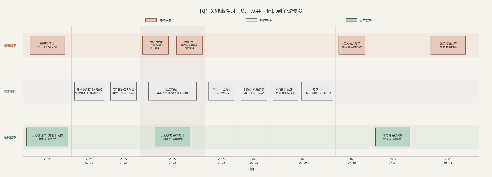

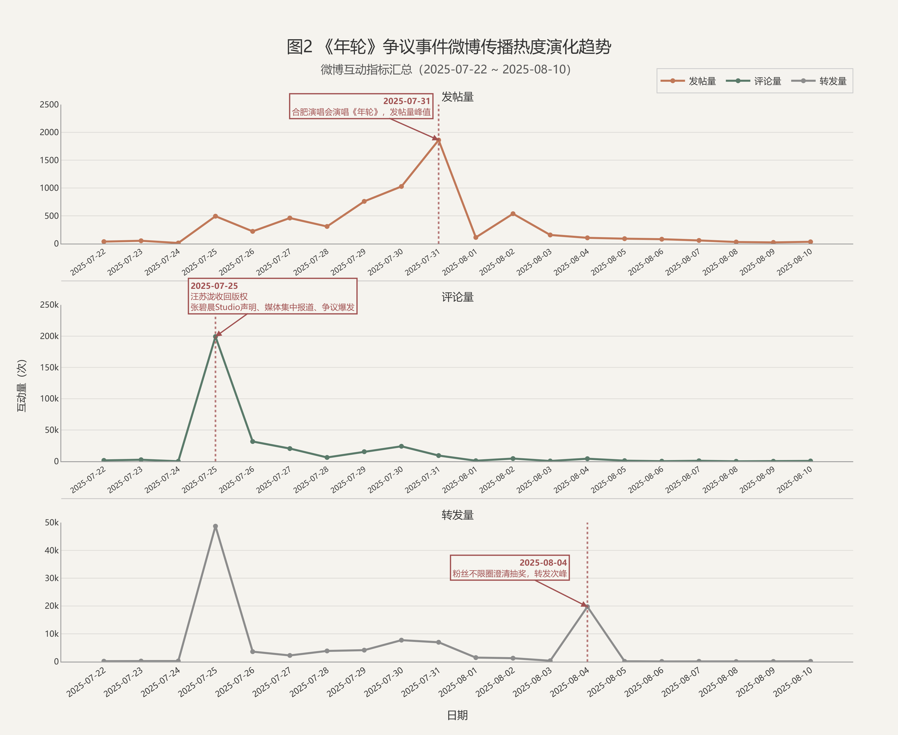

### Q1：这场争议是如何从普通讨论变成舆论事件的？

### 设计思路

对于"事件如何演化"这类问题，常见做法是堆文字时间线。图1 将时间线按三层叙事轨道排布——上层赤陶色（原唱叙事）、中层灰色（媒体事件）、下层松烟色（版权叙事）——同一日期在不同轨道上发生着不同的事件。图2 热度趋势用三条曲线叠加，与时间线上下对齐，揭示"哪个事件引发了哪种讨论爆发"。

### 分析过程

**第一步：识别爆发模式——这不是"烧开水"，这是"炸弹"。**

对照图1 事件时间线和图2 热度曲线，第一眼就能看到争议的最高峰——7月25日。但只看到"这是最高点"还不够，需要追问：它有多高？

答案令人吃惊。全量 14.0 万条数据中，**仅 7月25日一天就产出了 52,083 条**，占全部数据的 **37.1%**。如果再算上 7月26日（29,680 条），**response 阶段的 48 小时内集中了 58.2% 的全部讨论**。这不是"逐渐升温"，这是单点引爆——7月25日这一天，汪苏泷方宣布收回授权、张碧晨工作室发布两条声明、钱江晚报报道同日刊发，三方力量在同一个 24 小时窗口内交汇，产生了整个事件周期超过三分之一的内容。

这个"三线交汇"在图1 中体现为一目了然的视觉密度——上层赤陶轨道（原唱叙事）和中层灰色轨道（媒体事件）和下层松烟轨道（版权叙事）在 7月25日这一天全部出现标记，是整条时间线上唯一的三轨同时触发点。图2 的热度曲线在同一位置形成尖峰——不是缓坡，是近乎垂直的拉升。

**第二步：看三条曲线的"时差"——它们不是同步的。**

图2 用三条曲线分别追踪帖子、评论、转发的日频次。三者不是同涨同落，而是有明显的**时间错位**：

- **7月22-24日（outbreak 阶段）**：帖子与转发率先脉冲。旺仔小乔旧言论被挖出（7/22）、QQ音乐取消"原唱"标识（7/23），这两个事件首先触发了信息扩散——人们转发新闻，但还没有大规模涌入评论区表达立场。outbreak 阶段仅有 1,336 条记录，占总量的 1.0%。
- **7月25-26日（response 阶段）**：评论曲线垂直拉升到全周期最高点。7月25日当天评论 50,958 条，而同日转发仅 632 条——评论是转发的 **81 倍**。这意味着 7月25日双方声明发布后，用户的行为不是"转给朋友看"，而是**直接在评论区表达立场**。从"转发新闻"到"评论站队"，中间的 2-3 天是公众消化信息、形成立场的窗口期。
- **7月27-30日（debate 阶段）**：三条曲线整体下移，但出现了多次小反弹。7月29日 QQ音乐回应"张碧晨仍是原唱"引发 7,045 条讨论，7月30日路人长文复盘引发 9,260 条——但这些"二次高峰"的高度远不及 7月25日（仅为其约 1/7），整体呈低位波动态势。

这个时差模式揭示了一个清晰的传播节奏：**帖子"发起话题"→ 转发"扩散信息"→ 评论"站队表态"**。三种行为不是同时发生的，而是一个三拍子的节奏。

**第三步：看衰减——每枚新"炸弹"的威力都不如第一枚。**

从图2 的右半段可以读出一个递减序列。把每次事件触发的讨论量按时间排列：

| 日期 | 触发事件 | 讨论量 | 相对 7/25 |
|------|------|:---:|:---:|
| 7/25 | 双方声明 + 媒体报道 | 52,083 | 100% |
| 7/26 | 律师解读"原唱无法律定义" | 29,680 | 57% |
| 7/27 | — | 8,826 | 17% |
| 7/29 | QQ音乐回应"仍是原唱" | 7,045 | 14% |
| 7/30 | 路人长文复盘 | 9,260 | 18% |
| 7/31 | 汪苏泷演唱会唱《年轮》 | 9,432 | 18% |

同样类型的"官方声明"——7月25日触发 52K，7月29日 QQ音乐回应只触发 7.0K。同样的信息类型，约 1/7 的反应。原因不是后来的声明不重要，而是**公众的注意力和情绪已经在第一轮引爆中消耗殆尽**。每次新事件只能唤醒一部分已经疲劳的受众。

8月1日之后，日讨论量跌至 2,000 以下，进入漫长的 cooldown 长尾（27,395 条散布在 8-9 月，日均不足 500 条）。8月4日张碧晨粉丝抽奖澄清活动仅引发 1,236 条——一个在 outbreak 阶段可能引爆热搜的事件，在 cooldown 阶段已经无人关心。

### 结论

争议的传播是典型的"**引爆→递减→冷却**"模式，但有两个反直觉的发现。第一，**58% 的讨论集中在 48 小时内**——这不是一场持续两个月的讨论，而是一次 48 小时的集体情绪爆发，后面近两个月的"讨论"只是余震。第二，**发帖和评论的时间错位揭示了公众从"吃瓜"到"站队"的行为转换**：7月22-24日人们发帖讨论（"发生什么了？"），7月25-26日人们涌入评论区表达立场（"我站谁"）。这个 2-3 天的窗口期，就是舆论从信息扩散切换到立场表达的拐点。

---

## 四、网友到底在支持谁？

**Dashboard 章节**：立场分布与立场对比

**负责成员**：B 宋薇

**可视化**：图3 立场分布、图19 主帖评论转发的立场对比、图5 立场流变

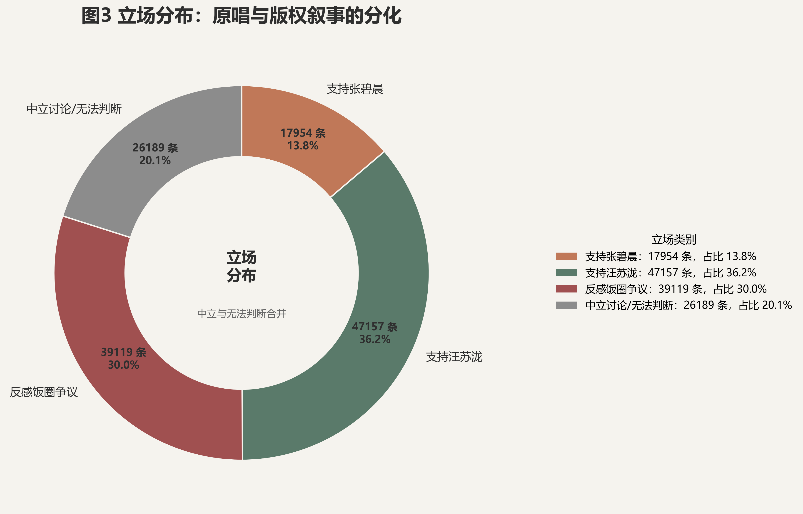

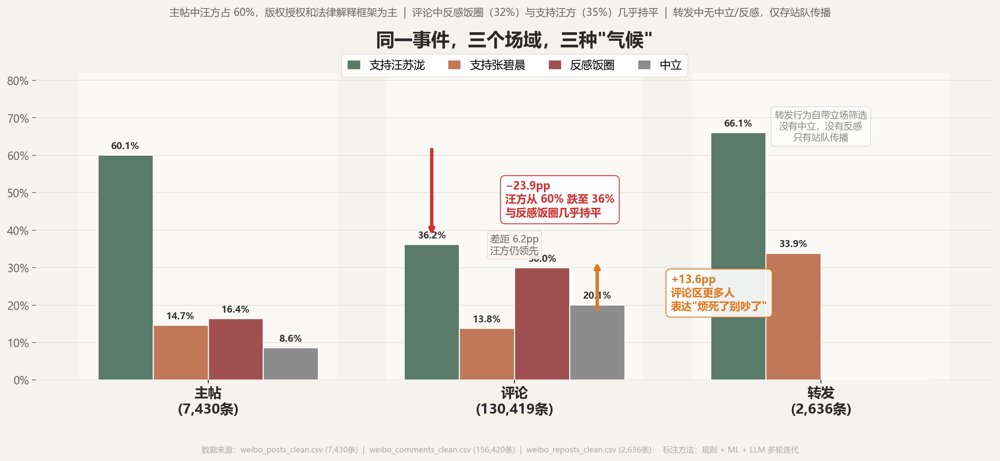

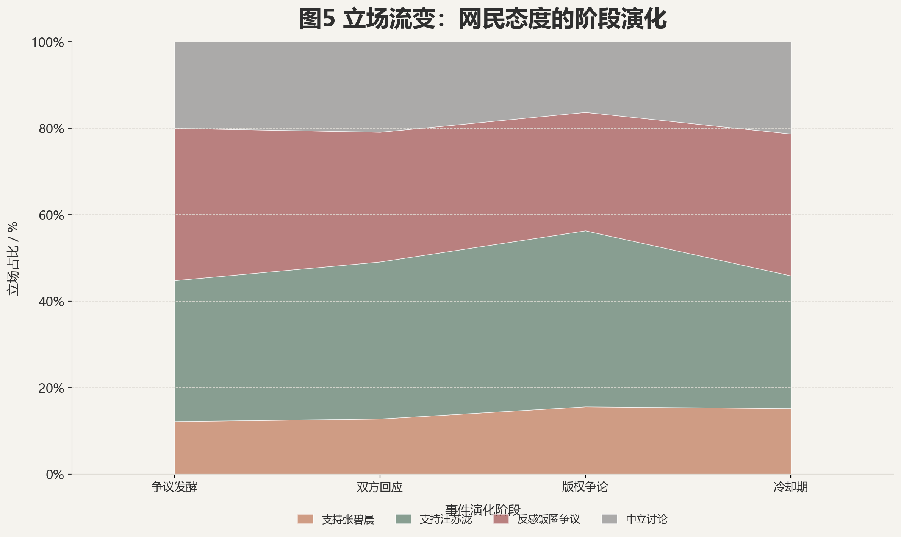

### Q2：网友到底在支持谁？

### 设计思路

立场分析的难点在于：**总体数字可能掩盖结构性分裂**。如果我们只看"支持张碧晨 vs 支持汪苏泷"的总体比例，结论是"差不多"，但这是错的。

为此，我们采用了**分层对比**策略：先用环形图看整体立场分布（图3），再将数据拆分为主帖、评论、转发三个子集对比不同场域的立场差异（图19），最后以时间维度展示立场比例的动态变化（图5）。三层视图让"谁在什么场合说什么"一目了然。

### 分析过程

先看图3的立场分布对比表：

| 立场 | 微博总表 140K | 主帖 7.4K | 评论 130K | 转发 2.6K |
|------|:---:|:---:|:---:|:---:|
| support_zhang | 14.2% | 14.7% | 13.8% | 33.9% |
| support_wang | **38.0%** | **60.1%** | **36.2%** | **66.1%** |
| neutral | 19.1% | 8.6% | 20.1% | 0.0% |
| anti_fanwar | **28.7%** | 16.4% | **30.0%** | 0.0% |
| unclear | 0.0% | 0.2% | 0.0% | 0.0% |

关键发现出现在**主帖与评论的对比**。主帖中 support_wang 占压倒性 60.1%，但评论区的情况完全不同：support_wang 降至 36.2%，而 anti_fanwar 升至 30.0%——差距从主帖的 43.7pp 缩小到 6.2pp。这意味着在主帖空间里，"支持汪苏泷"是绝对主流声音；但在评论区里，反感饭圈的声音逼近了支持汪苏泷。

图19 将这一对比视觉化。三栏柱状图分别展示主帖、评论、转发三个场域的立场分布——三个场域的数据来自三个独立采集的 CSV 文件（`weibo_posts_clean.csv`、`weibo_comments_clean.csv`、`weibo_reposts_clean.csv`），主帖和评论在数据采集阶段就是分开爬取的。从图中可以直观看到两个核心变化：① 支持汪苏泷从主帖的 60.1% 跌至评论的 36.2%（下降 23.9 个百分点），② 反感饭圈从主帖的 16.4% 升至评论的 30.0%（上升 13.6 个百分点），与支持汪苏泷的差距缩小。

这个对比可以用叙事框架的分布来交叉验证。主帖的框架高度集中在版权授权（35.6%）和平台讨论（35.6%），其次是法律解释（12.6%）——主帖发帖者在讨论版权条文和授权规则。而评论区的框架被粉丝冲突（**58.0%**）统治——超过一半的评论不是在讨论版权或原唱，而是在站队互撕。主帖的讨论重心是"谁有道理"，评论区的讨论重心是"你站哪边"。

这就解释了为什么 anti_fanwar 在评论区高达 30.0% 而在主帖仅 16.4%：**越是在讨论空间里浸泡的人，越容易对争吵本身产生厌倦**。评论区是争吵发生的地方，anti_fanwar 本身就是对评论区的情绪反应——它不是一种立场，而是一种"受够了"的 meta-commentary。

转发数据更极端：support_wang 66.1%、support_zhang 33.9%，neutral 和 anti_fanwar 均为零——转发行为自带立场筛选，不站队的人不会转发。

图3 和图19 回答的是"不同空间里谁占优"，但它们是静止快照——看不到立场是如何随时间演化的。图5（立场流变堆积面积图）补上了时间维度。将评论数据按事件阶段拆分，各阶段的立场占比如下：

| 阶段 | 条数 | 支持张碧晨 | 支持汪苏泷 | 反感饭圈 | 中立 |
|------|:---:|:---:|:---:|:---:|:---:|
| 争议发酵 | 1,237 | 12.2% | 32.6% | **35.2%** | 20.0% |
| 双方回应 | 79,980 | 12.8% | **36.3%** | 30.0% | 20.9% |
| 版权争论 | 26,207 | 15.6% | **40.7%** | 27.4% | 16.4% |
| 冷却期 | 22,995 | 15.2% | 30.7% | **32.8%** | 21.3% |

从这张表中浮现出三个与直觉相反的发现。

**第一，汪方优势不是"逐步建立"的，而是从头到尾都存在。** 四个阶段中，support_wang 在两个阶段是最大单一群体（31%–41%），在另外两个阶段与反感饭圈交替领先。争议发酵期反感饭圈以 35.2% 略微领先汪方 32.6%，但到了版权争论期汪方拉升至 40.7%——不是从零起步，而是从已有基础上进一步扩大。

**第二，反感饭圈不是"逐渐升温"的，而是一开始就是强信号。** anti_fanwar 在四个阶段中从未低于 27%，在争议发酵期达到峰值 35.2%——比汪方（32.6%）还高 2.6 个百分点。"烦死了别吵了"不是事件的副产品，而是与事件同步爆发的核心情绪。随着法律论证在版权争论期成为焦点，anti_fanwar 有所回落（27.4%），但在冷却期又回升至 32.8%——离开的是讨论版权的人，留下的不满仍在。

**第三，中立始终是少数，立场结构高度稳定。** 与"多数人在吃瓜观望"的直觉相反，中立占比在四个阶段中始终在 16%–21% 之间——人们一直在站队，没有经历"从围观到选边"的转化。更值得注意的是，冷却期的立场比例（汪 31% / 反感 33% / 张 15% / 中立 21%）与争议发酵期高度相似。讨论量从 8 万条降至 2.3 万条，但站队比例变化很小。舆论的"降温"是音量变小了，不是立场变了。

### 结论

总体而言，全量 14.0 万条数据中，**支持汪苏泷占 38.0%，支持张碧晨占 14.2%**——汪方约为张方的 2.7 倍。这是最直接的答案。

但这个总数掩盖了更重要的结构——**这是第一个"双生"发现**：回答"网友在支持谁"，答案取决于你问的是**哪个空间**，也取决于你问的是**哪个时间**。在空间维度上，主帖以版权授权框架为主（35.6%），support_wang 压倒性 60.1%；评论区里 58% 的发言属于粉丝冲突，anti_fanwar 以 30.0% 紧逼 support_wang（36.2%）。在时间维度上，汪方的优势从一开始就存在，版权争论期进一步拉升至 40.7%；反感饭圈不是逐渐升温的——争议发酵期就已达到 35.2%，是讨论中持续存在的强信号；中立反而始终是少数（16%–21%），多数人从一开始就在站队。冷却期的立场结构与争议发酵期几乎完全相同——舆论的降温是音量变小，不是立场变了。

---

## 五、这场争议是通过谁传播出去的？

**Dashboard 章节**：传播网络与核心节点

**负责成员**：C 陈子怡

**可视化**：图6 传播网络、图9 账号类型网络、图10 传播矩阵

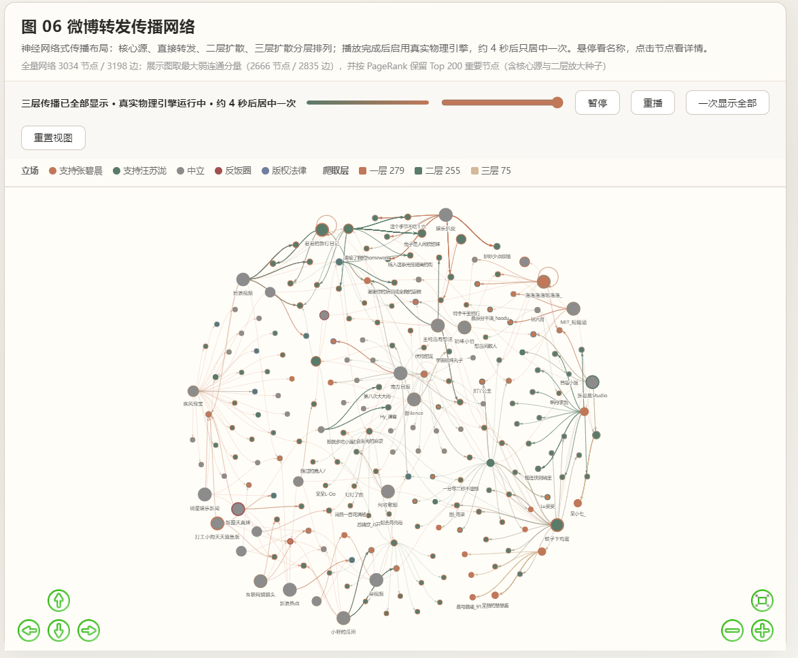

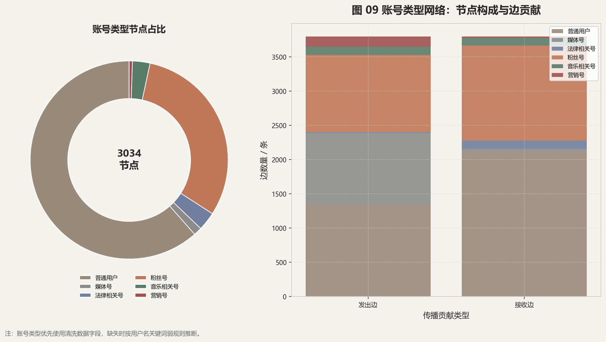

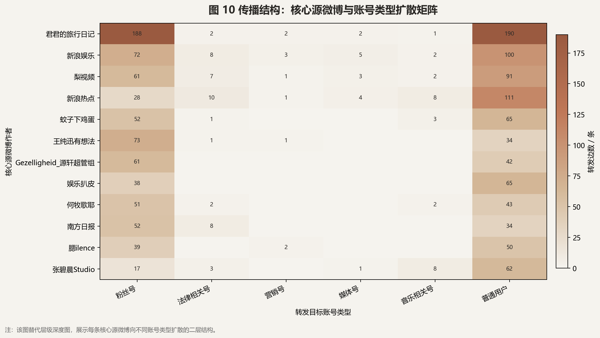

> 注：图6（传播网络）为交互式力导向图（`fig_06_repost_network.html`），建议在浏览器中查看完整交互效果。

### Q3：这场争议是通过谁传播出去的？

### 设计思路

微博的转发关系天然适合用**力导向网络图**表达。但全量网络（3,002 节点、3,801 边）如果直接绘制会变成无法阅读的"毛线球"。

我们的策略是：先用网络全图展示整体拓扑结构（图6），再用环形图和堆叠柱状图呈现参与者的账号类型构成（图9），最后用源头×账号类型的扩散矩阵定位具体的"广播塔"是谁（图10）。

### 分析过程

**第一步：看整体拓扑——这不是网状传播，是广播。**

打开图6（力导向网络图），3,002 个节点和 3,801 条边并没有变成一团"毛线球"，而是呈现出清晰的**广播星型结构**：39 个被转发源头（大节点）各自形成独立簇，转发者（小节点）如卫星般围绕在各个源头周围——这是图6 能直观看到的拓扑特征。

进一步分析转发链数据可以验证这一结构：3,801 条边中，**82.4%（3,132 条）是一跳直达**——转发者直接转发原始帖子，没有经过任何中间人。仅有 14.9% 的边形成二跳链，三跳以上的链路只存在于 2 条根帖子中（共 101 条边，占 2.7%）。这意味着争议的传播几乎不依赖"朋友转发朋友"的病毒级联——它靠的是源头的一次性广播覆盖。每个源头帖子发出后，成百上千人同时转发，然后链路就断了。这不是"传话游戏"，这是"扩音器"。

**第二步：看参与者构成——谁在转发？**

在识别具体的"广播塔"之前，先看清整个转发场的参与者结构。图9 用环形图展示了 3,034 个节点的账号类型构成，堆叠柱状图则对比了各类型在"发出边"和"接收边"中的贡献。六类账号中，**普通用户占节点的绝大多数**，但边贡献主要集中在媒体号、粉丝号和营销号身上——普通用户更多是"接收"转发而非"发出"转发。这意味着传播的驱动力不是普通用户的自发扩散，而是一小撮媒体和营销账号在推动。

**第三步：定位广播塔——12 个源头，三种身份。**

图10 的扩散矩阵将 12 个核心源微博账号逐一列出（纵轴），横向展示每条源头微博被哪种账号类型转发（横轴），每个格子内的数字就是转发量。**这是整个 Q3 最关键的一张图**——从矩阵中可以逐一读出每个源头的传播构成。

排名第一的源节点是娱乐 KOL **"君君的旅行日记"**：粉丝号转发 188 条、普通用户 190 条，产生了远超任何一家媒体机构的总转发量。一个个人账号的传播力压过《南方日报》（粉丝号 52 + 普通用户 34）、《梨视频》（粉丝号 61 + 普通用户 91）。

前 10 源头中，媒体占 6 席（新浪娱乐、梨视频、南方日报、新浪热点、后浪视频、娱乐扒皮），个人 KOL 占 3 席（君君的旅行日记、何牧歌耶、王纯迅有想法），而官方账号只占 1 席——**张碧晨 Studio**（粉丝号 17 + 普通用户 62）。

一个值得注意的缺席：**汪苏泷方的官方账号没有出现在这 12 个核心源头中**。张碧晨工作室的声明形成了独立的传播簇，而汪方的声明主要通过媒体和 KOL 间接扩散。这意味着两方采用了截然不同的传播策略：张方靠官方渠道直接发声；汪方靠媒体和 KOL 代为扩散、走"第三方背书"路线。

**第四步：看转发隔离——94.7% 的人从未跨过阵营。**

回到图10 的矩阵，还能读出另一个模式：颜色最深的格子几乎全部集中在"普通用户"和"粉丝号"两列——无论源头是媒体、KOL 还是官方账号，转发的主力始终是这两类用户。"音乐相关号""营销号""法律相关号"三列几乎全白，在整个传播中贡献极小。这意味着争议的传播不是"各类型账号各转各的"，而是**普通用户和粉丝号承担了几乎所有转发量**。

进一步统计转发者行为可以量化信息隔离的程度：3,002 个转发者中，**只有 5.3%（160 人）曾经转发过来自不同根帖的内容**。换言之，94.7% 的转发者只待在自己的信息茧房里——他们关注的那个源头就是这场争议的全部。

更具体地说：媒体账号和营销号是仅有的"跨阵营桥梁"，它们的转发客观上把双方声音送进了对方的信息流。而粉丝号几乎不存在跨阵营转发——张碧晨粉丝只转张方的帖，汪苏泷粉丝只转汪方的帖。回到图6 的网络拓扑也能印证这一点：两边的转发树在视觉上**几乎不接触**。

这解释了一个反直觉的现象：为什么同一事件有两种完全不同的舆论面貌？因为信息传播本身就被隔离了。一个人如果只关注张方粉丝，他的转发流里永远不会出现汪方的论证——反之亦然。传播网络的拓扑结构本身就是"双生"的物理证据。

### 结论

争议的传播不是"病毒式扩散"，而是**广播式覆盖**：39 个源头各自拥有不重叠的听众群，82% 的转发只发生一次就终止。张碧晨方通过官方工作室自建广播塔（223 条转发），汪苏泷方通过媒体和 KOL 外包扩散——两种策略反映了两种不同的传播资源。更根本的是：94.7% 的转发者从未跨阵营转发——这不是"两套话语擦肩而过"，这是两套话语**从未进入同一个信息流**。传播网络本身，就是"双生年轮"最直观的拓扑证据。

---

## 六、大家讨论的到底是什么？

**Dashboard 章节**：关键词演化与叙事分析

**负责成员**：D 张欣

**可视化**：图11 高频词 Top30、图12 叙事桑基图

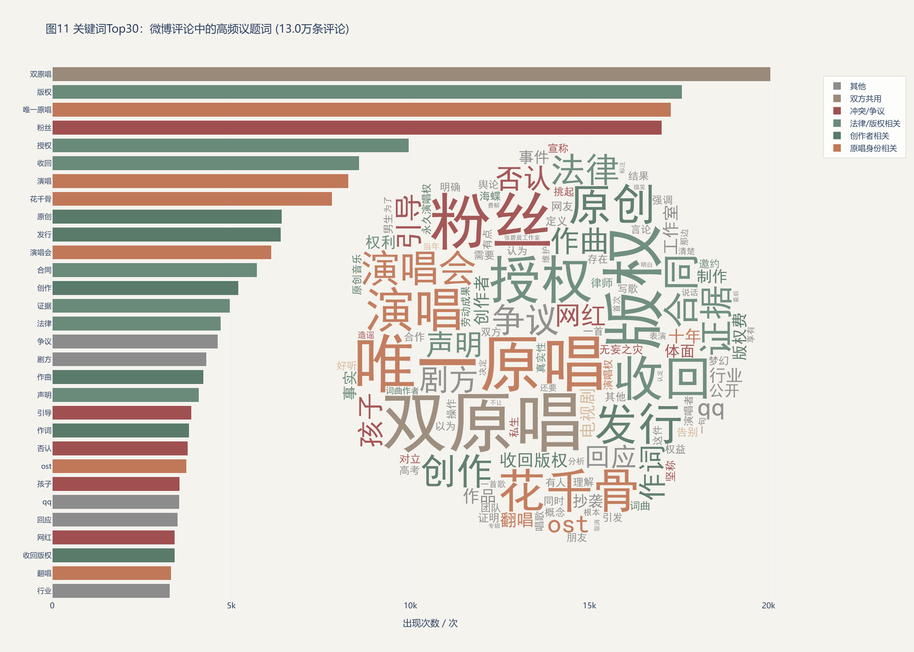

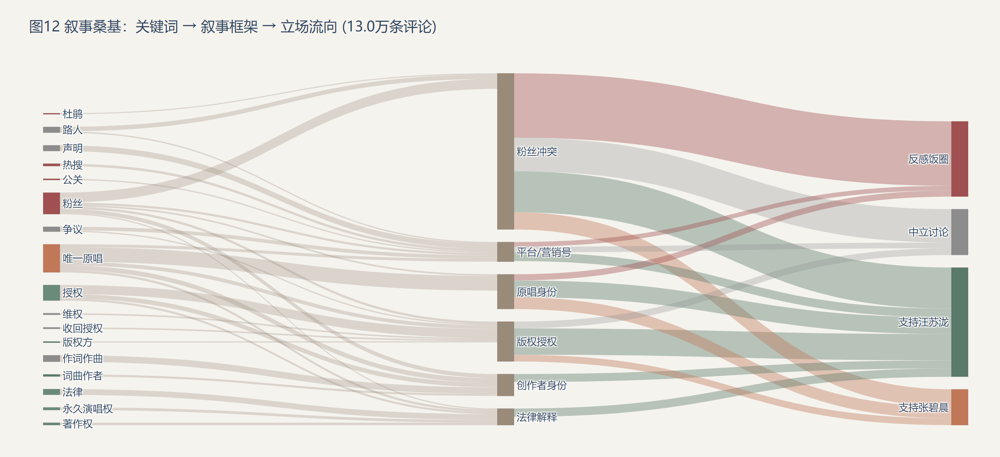

> 注：图11（`fig_11_keyword_top30.html`）和图12（`fig_12_narrative_sankey.html`）为 Plotly 交互式图表，含词云嵌入和三层桑基图动画，建议在浏览器中查看完整交互效果。

### Q4：大家讨论的到底是什么？

### 设计思路

关键词分析容易陷入"堆砌高频词"的陷阱。我们设计了两张递进式图表来回答"从词到叙事"：先用图11展示"双方各自在用哪些词"，按七类颜色分组着色的柱状图+蒙版词云让两套话语的色彩差异一目了然；再用图12将"关键词→叙事框架→立场"完整打通——词语选择决定了框架，框架决定了立场。

### 分析过程

在看具体词汇之前，先看叙事框架的整体分布——这个数字本身就是一个发现。全量 14.0 万条数据中，**粉丝冲突（fan_conflict）框架占 55.1%**，超过其余六个框架的总和。版权授权占 14.9%、原唱身份占 13.7%、平台讨论占 6.9%、法律解释占 5.9%、创作者身份仅 3.3%、回忆情感不足 0.1%。超过一半的讨论不在争论"谁对谁错"，而在站队互撕——这个数字定义了整场争议的性质。

**图11（高频词）**：柱状图按七类颜色分组。松烟色（创作者相关，3.3%）和灰绿色（法律相关，5.9%）合计不到 10%，但在柱状图中视觉占比很大——因为法律/版权类词汇（"版权""授权""收回""合同"）频次极高，是讨论中最"硬"的关键词。赤陶色（原唱身份）约占四分之一——"唯一原唱""花千骨""OST""十年"等身份/情感词汇集中在张方阵营。右下角嵌入的蒙版词云用 120 词补充腰部词汇，两个阵营的词汇体系几乎不重叠：张方词云以"十年""青春""陪伴"为中心，汪方词云以"原创""版权""法律"为中心。

**图12（桑基图）**：三层结构将"关键词→叙事框架→立场"完整打通。从左到右追踪流向：

- **版权授权框架（14.9%）→ 59% 流向 support_wang**，15% 流向 support_zhang，16% 分流至 neutral。版权论证是汪方最有力的武器。
- **原唱身份框架（13.7%）→ 42% 流向 support_wang，31% 流向 support_zhang**，16% 流向 anti_fanwar。这个分流说明"原唱"概念本身不是某一方的专属——双方都在争夺"谁是原唱"的定义权。汪方主张"创作者也是原唱"，张方主张"首唱者才是原唱"。
- **粉丝冲突框架（55.1%）→ 44% 流向 anti_fanwar**，24% 流向 support_wang，22% 流向 neutral。这是最粗的一股流——超过一半的讨论属于这个框架，其中近一半流向了"反感饭圈"。这意味着争议的真正推手不完全是立场对立，而是**冲突本身的自我繁殖**：吵架产生更多吵架，anti_fanwar 是对吵架的反弹，但反弹本身也推动了讨论量。
- **创作者身份框架（3.3%）→ 81% 流向 support_wang**——这是所有框架中最单向的流。当讨论聚焦于"谁写了这首歌"时，几乎一边倒支持汪苏泷。

桑基图的视觉结构本身就是结论：左半侧密集分叉（多种关键词输入），中段分流重构（七种框架），右半侧再度分叉（五种立场）。这个"分-合-分"的拓扑结构，就是"双生"话语体系的视觉翻译。

### 结论

**这是第二个"双生"发现**，但比预想的更复杂。双方确实在不同的框架下发言——张方主导"原唱身份"、汪方主导"版权授权"和"创作者身份"。但最大单一框架是粉丝冲突（55.1%），它不属于任何一方，而是**冲突自身成为了讨论的主题**。这意味着争论的核心不是"谁对"，而是"谁和谁在吵"——争议已经从事实辩论演变为群体对抗。两套语言互不兼容，但更根本的是：大部分讨论已经不在乎"兼容"了。

---

## 七、有趣的发现

在完成四个核心问题的系统分析后，我们从数据中挖掘出三个反直觉的"Case"——它们不是独立的研究问题，而是**数据背后的故事**，让分析从"回答问题"升级为"发现现象"。这三个 Case 在 Dashboard 中独立成章，是整条叙事中最有"网感"和冲击力的部分。

---

### Case 1：双方不是在吵同一件事情

**Dashboard 标题**：Case1：双方不是在吵同一件事情！！！

**可视化**：图15 双阵营话题框架对比、图4 双阵营词云对比

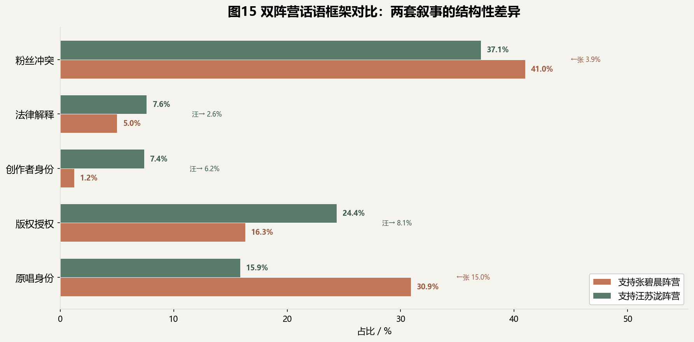

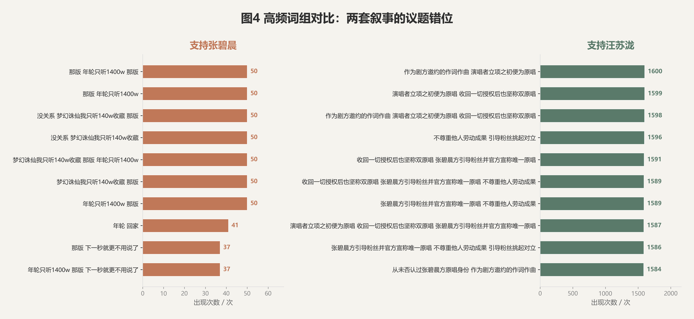

> "汪苏泷粉丝聊'版权'和'授权'，张碧晨粉丝聊'原唱'和'花千骨'。"
>
> "主帖在讲版权法，评论在讲'我听了十年'——这两拨人根本没对上话。"

#### 两套话语体系对比

这是对 Q4（关键词分析）的进一步深化。我们将两个阵营各自使用的词汇拆开分析，揭示了"双套话语"现象：

**汪苏泷阵营高频词**：版权、授权、收回、合同、创作、词曲、原创、工作室、证据、法律……

**张碧晨阵营高频词**：原唱、花千骨、OST、唯一、十年、演唱会、告别、青春、记忆、陪伴……

两套词汇几乎不重叠。汪方讨论的是一个**法律问题**（"谁拥有这首歌的权利"），张方讨论的是一个**情感问题**（"谁陪伴了我们的青春"）。当一方说"版权法第X条"，另一方说"我听了十年"，这根本不是对话——是两套话语体系擦肩而过。

#### 框架对比

从叙事框架的阵营分布来看（仅统计 support_zhang 和 support_wang 立场的评论）：

| 叙事框架 | 汪方占比 | 张方占比 | 差异 |
|------|:---:|:---:|------|
| 粉丝冲突 | **41.0%** | **45.4%** | 双方均为最大框架，张方略高 |
| 版权授权 | **22.8%** | 14.3% | 汪方高 8.5pp |
| 原唱身份 | 16.8% | **30.5%** | 张方高 13.7pp |
| 创作者身份 | **7.1%** | 1.0% | 汪方高 6.1pp（差距最大） |
| 法律解释 | **6.9%** | 4.7% | 汪方高 2.2pp |

一个容易被忽略的事实：**双方阵营的最大框架都是粉丝冲突**——汪方 41.0%、张方 45.4%。这意味着即使在明确站队的人里，也有超过四成的发言不是在论证"为什么我对"，而是在参与阵营对抗。张方唯一显著占优的框架是原唱身份（30.5% vs 16.8%），汪方在版权授权（22.8% vs 14.3%）和创作者身份（7.1% vs 1.0%）上占优。差距最大的不是版权授权，而是创作者身份——当讨论聚焦于"谁写了这首歌"时，汪方以 7:1 的悬殊比例胜出。这说明汪方最锋利的论证不是"版权归我"，而是"歌是我写的"。

---

### Case 2：统一话术刷屏——年轮论战早已脱离讨论本身

**Dashboard 标题**：Case2：统一话术刷屏，年轮论战早已脱离讨论本身

**可视化**：图18 同质化内容分布、模板评论展示

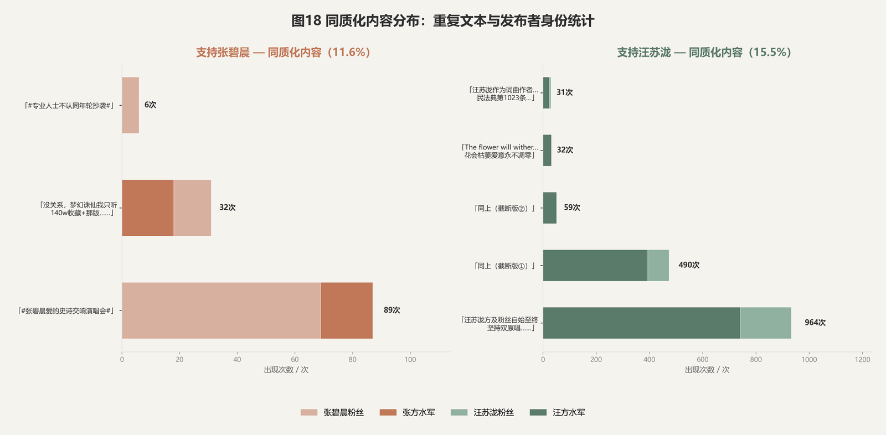

> "评论区有条评论，一字不改复制粘贴了 1513 遍——谁干的？"

#### 模板化评论

在评论区中，我们发现大量完全相同的评论文本被反复发布。以下为双方阵营的典型模板：

**汪方模板**（重复 1513 次）：

> *"汪苏泷方及粉丝自始至终坚持双原唱，从未否认过张碧晨方原唱身份，作为剧方邀约的作词作曲+演唱者立项之初便为原唱，收回一切授权后也坚称双原唱；张碧晨方引导粉丝并官方宣称唯一原唱，不尊重他人劳动成果，引导粉丝挑起对立，且列举的证据均为主观上传无真实性。原创音乐人无妄之灾——支持汪苏泷"*
>
> ━━━ **重复 1513 次** ━━━

**张方模板**（重复 32 次）：

> *"没关系，梦幻诛仙我只听 140w 收藏+那版，年轮只听 1400w+那版，下一秒就更不用说了——支持张碧晨"*
>
> ━━━ **重复 32 次** ━━━


#### 不是商业水军，是粉丝自发组织化

进一步分析发现：
- 全量 13.0 万条评论中，识别出 **732 条不同的模板文本**（重复 ≥3 次），涉及 **5,925 条评论（3.8%）**。绝对数量不大，但模板评论集中在高互动热帖下，曝光量远高于普通评论。
- 汪方核心模板以三种变体出现（737 + 462 + 57 条），合计约 1,256 条；张方主要模板（@张碧晨Studio 71 条 + 话题标签 56 条等）合计约 127 条。**模板数量比约 10:1**，汪方组织化程度远高于张方。
- "水军"被提及 13 次、"控评"24 次、"公关"154 次——**普通用户也在讨论水军现象，说明它被广泛感知**。
- 最高频用户"恭喜发财_"发 19 条，Top10 用户各发 8-19 条——没有出现单用户数百条刷屏的典型商业水军特征。
- 定性判断：**非商业水军，而是粉丝自发组织化复制粘贴**。汪方模板化程度高于张方，且模板内容为完整论证段落（非简单口号），更接近"粉丝群统一话术"而非机器灌水。

这个发现的意义在于：当讨论从"表达观点"退化到"复制粘贴模板"，争议的性质已经变了——它不再是关于《年轮》的争论，而是一场**话语权的组织化争夺**。评论区成了战场，评论本身成了弹药。

---

### Case 3：不同平台，不同世界

**Dashboard 标题**：Case3：在不同平台中，张碧晨在豆瓣中支持率成碾压式！！

**可视化**：图14 平台立场对比、图16 豆瓣张碧晨支持率分析

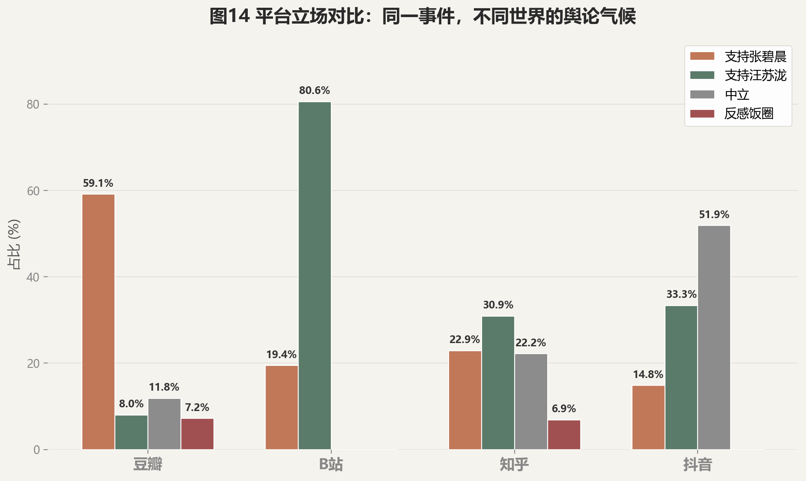

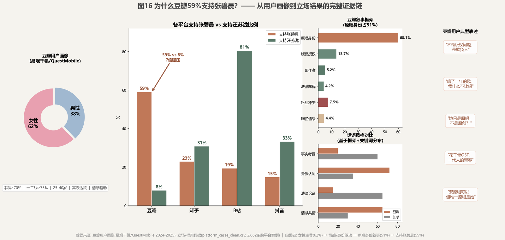

> "豆瓣 59.1% 支持张碧晨，B站 80.6% 支持汪苏泷——同一首歌，两个世界。"
>
> "在豆瓣发一条'支持汪苏泷'会怎样？——8%的人试过。"
>
> "知乎讲法律，豆瓣讲感情，B站讲原创——平台决定了'谁是对的'？"
>
> "如果把豆瓣评论区搬到B站，会发生什么？——那可能是中文互联网最精彩的打架。"

#### 平台立场对比

我们对四平台跨平台案例（2,862 条）进行了立场标注，结果呈现极端差异：

| 平台 | 支持张碧晨 | 支持汪苏泷 | 主导叙事 |
|------|:---:|:---:|------|
| 豆瓣 | **59.1%** | 8.0% | 原唱身份 51% |
| B站 | 19.4% | **80.6%** | 版权授权 81% |
| 知乎 | 22.9% | **30.9%** | 版权授权 28% |
| 抖音 | 14.8% | 33.3% | 中立 51.9% |

豆瓣 **7:1** 碾压式支持张碧晨，B站 **4:1** 压倒性支持汪苏泷——同一首歌，两个世界。

#### 为什么是豆瓣？

豆瓣专题（`fig_16_douban_why.png`）提供了五面板证据链：

1. **用户画像**：豆瓣用户 62% 为女性
2. **立场分布**：support_zhang 59.1%，support_wang 仅 8.0%
3. **主导框架**：original_singer 51%——"原唱身份"叙事压倒性
4. **情绪特征**：anger 情绪是四平台最高的——情感浓度最高，但不等于没有论证
5. **典型表述**：
   - 情感线："花千骨买的首唱权，她就是原唱，何况唱了十年""明明是她的声音陪了我们十年"
   - 事实线："花千骨剧组买了首唱权，张碧晨就是原唱，这是合同白纸黑字""又没签终身独占，既然卖了授权，人家收回去也没什么"
   - 版权线："词曲版权归汪苏泷没争议，但演唱权当时是花千骨买给张碧晨的，她是合法原唱"

**用户画像为什么重要？** 豆瓣 62% 的女性用户比例不是背景数字。张碧晨的叙事——"花千骨买了首唱权，合同上我就是原唱，何况唱了十年"——讲的是**契约被承认、贡献被尊重**；汪苏泷的叙事——"我写的，版权归我，依法收回"——讲的是**权利和规则**。两种叙事都是事实，但打动的人群不同。这不等于女性"不讲道理"——豆瓣的版权授权框架占 11.6%（第二高），只是豆瓣用户习惯把法条放在身份语境下讲（"花千骨买的首唱权，这本身就是合同"），而知乎直接引条文。论据相同，话术不同。

豆瓣用户的核心逻辑是**"花千骨买了首唱权→张碧晨合法成为原唱→她是唯一原唱"**——这并非纯感情用事，而是一条有合同依据的论证链。只是他们把这个论证放在"原唱身份"而非"版权授权"的框架下表达。版权授权框架在豆瓣占 11.6%（第二高），说明相当一部分豆瓣用户也在讨论版权，只是没有知乎（28%）那么系统。而 B站的 anger 为零——创作者文化的共识使争议在这里被简化为"原创者有权收回"。

#### 平台预设了"正确答案"

这个 Case 揭示了一个深层现象：**平台不是中立的传播管道——社区的默认立场预设了哪种叙事能赢**。

| 平台 | 默认逻辑 | 典型论据 |
|------|------|------|
| 豆瓣 | 首唱权=原唱身份 | "花千骨买了她的声音，她就是原唱——有合同的" |
| 知乎 | 条文/法律 | "版权归属需要看合同条款和授权期限" |
| B站 | 原创/创作 | "原创者有权决定谁唱自己的歌" |
| 抖音 | 吃瓜/娱乐 | "两边都有道理，看看就好" |

---

### 双生年轮主视觉

> 图13 是整个项目的视觉锚点——"双生年轮"四个字浓缩了全部发现。

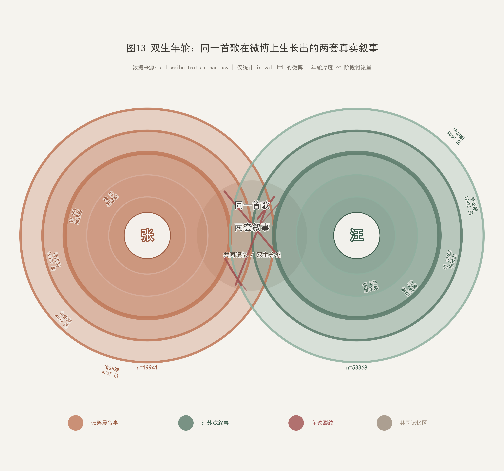

#### 为什么是"年轮"？

树的年轮从同一圆心向外生长，每一圈记录一年的气候——干旱则薄，丰沛则厚。两道年轮共享同一条根，却在关键年份各自走向不同的纹理。

《年轮》这首歌于 2015 年随《花千骨》OST 诞生。张碧晨的演唱版本和汪苏泷的创作版本，就像两圈年轮从同一圆心出发：共享一个起点，却在十年间各自积累不同的厚度、颜色和纹理。到 2025 年旺仔小乔事件引爆时，两圈年轮已经长得完全不一样了——但它们都"是真的"。

#### "双生"的三层含义

**第一层：身份的双生。** 同一首歌，诞生了两个"原唱"——张碧晨是花千骨剧组购买首唱权后指定的演唱者（OST 原唱），汪苏泷是词曲作者兼 Demo 演唱者（创作者原唱）。两人都称"原唱"，但用的是不同坐标系。这不是一个"谁说谎"的问题，而是一个"原唱这个词本身就没有唯一定义"的问题。

**第二层：话语的双生。** 图11-12 揭示了两套完全不同的词汇体系——张方用"十年""青春""OST""花千骨"讲话，汪方用"版权""授权""合同""原创"讲话。两套话语描述的是同一事件，但词汇几乎不重叠。这不是两种观点在辩论，而是两套语言体系在自说自话。

**第三层：平台的双生。** Case 3 证明，同一首歌在不同平台上有截然不同的"正确答案"——豆瓣 59% 支持张碧晨（首唱权=原唱），B站 81% 支持汪苏泷（原创者=原唱），知乎讲法律条文，抖音吃瓜看戏。平台不是中立的传播管道——平台的社区文化预设了哪种叙事能赢。

#### 图13 的视觉语言

图13（`fig_13_twin_rings.html`）用**同心圆树轮结构**将这三种"双生"编码为一个视觉隐喻：

- **左侧年轮（赤陶色系）**：原唱身份叙事——从 2015 年花千骨 OST 的共同记忆开始生长，每圈年轮代表一年，厚度对应讨论热度
- **右侧年轮（松烟色系）**：创作者/版权叙事——同样从 2015 年开始生长，但在关键事件节点出现裂纹
- **裂纹（绯红色）**：标注在争议事件发生的时间点——旺仔小乔直播、汪苏泷收回授权、张碧晨工作室声明——每一次事件都是一次撕裂
- **年轮厚度**：对应该时期的讨论热度——越厚代表舆论越激烈

两道年轮从同一圆心出发，共享 2015-2024 年的平静生长，在 2025 年 7 月剧烈分叉。它们从未融合，但始终共用一个坐标系。

图13 作为主视觉，既是一张独立作品，也是整个仪表盘的视觉锚点。它不回答"谁对谁错"，而是回答：**为什么同一首歌会分裂成两个世界——以及这两个世界是否还有对话的可能。**

---

## 八、总结

### 核心发现

| 维度 | 发现 | 相关章节 |
|------|------|:---:|
| **时间** | "节点触发型传播"，关键事件如炸弹连续引爆讨论 | §事件时间线与热度趋势 |
| **立场** | 总体 2.7:1（汪:张），但主帖与评论区讨论焦点完全不同——主帖以版权论证为主（汪方 60%），评论区反感饭圈（30%）紧逼汪方（36%） | §立场分布与立场对比 |
| **传播** | 多中心扩散，双方阵营粉丝号几乎不交叉转发，坐实"双生"结构 | §传播网络与核心节点 |
| **内容** | 话语从"身份争夺"→"权利争论"→"情绪总结"三阶段迁移，"合同"一词的排名飙升是法律框架接管讨论的关键信号 | §关键词演化与叙事分析 |
| **话术** | 双方用的是两套几乎不重叠的词汇体系——张方谈"十年""青春""OST"，汪方谈"版权""授权""合同"。同一事件，两种语言，从未真正对话（Case 1） | §有趣的发现 Case1 |
| **组织化** | 评论区出现大量一字不改的模板复制粘贴，最高单条重复 1513 次——非商业水军，而是粉丝自发的组织化行为。当讨论退化到复制粘贴，争议已不再是关于《年轮》，而是话语权的争夺（Case 2） | §有趣的发现 Case2 |
| **平台** | 豆瓣 59% 支持张碧晨、B站 81% 支持汪苏泷、知乎讲法律、抖音吃瓜——平台社区文化预设了"谁是对的"（Case 3） | §有趣的发现 Case3 |
| **双生** | 两套并行叙事同根而生、裂纹而分、从未真正对话——这就是"双生年轮" | §双生年轮主视觉 |

### 三句话总结

1. **没有人在撒谎**：双方各自掌握着事实的一部分——张碧晨确实是"首唱者"（OST版），汪苏泷确实是"词曲作者+首唱者"（Demo版）。
2. **但也没有人在讲完整的故事**：张方忽略版权归属，汪方忽略十年传唱的情感事实。
3. **这就是双生年轮**：同根而生（来自同一首歌《年轮》），裂纹而分（在关键事件节点分裂为两套叙事），从未真正对话。

### 结尾

> 吵了两个月，发了 14 万条数据——最后发现，相信"原唱是唱出来的"的人，和相信"原唱是写出来的"的人，谁也说服不了谁。
>
> 没有人在撒谎，但也没有人在讲完整的故事。这就是双生年轮。
>
> **"双生年轮"——同根而生，裂纹而分，平台为壤，记忆成纹。**

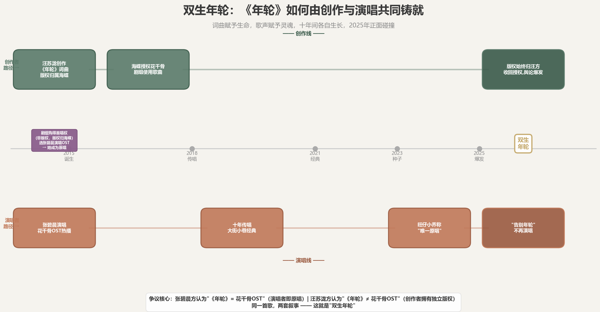

---

## 附录

### A. Dashboard 图表对照表

Dashboard 对原始图表进行了重新编号。以下对照表列出了 Dashboard 编号与原始文件名的对应关系：

| Dashboard 编号 | 原始文件 | 类型 | 负责 | 所属章节 |
|:---:|------|------|:---:|------|
| 图1 | `fig_01_event_timeline.html` | 交互时间线 | A | §事件时间线 |
| 图2 | `fig_02_heat_trend.html` | 热度趋势 | A | §事件时间线 |
| 图3 | `fig_03_stance_distribution.html` | 立场分布 | B | §立场分布 |
| 图4 | `fig_05_stance_over_time.html` | 立场流变 | B | §立场分布 |
| 图5 | `fig_06_repost_network.html` | 传播网络 | C | §传播网络 |
| 图6 | `fig_09_account_type_network.html` | 账号类型网络 | C | §传播网络 |
| 图7 | `fig_11_keyword_top30.html` | 高频词 Top30 | D | §关键词演化 |
| 图8 | `fig_12_narrative_sankey.html` | 叙事桑基图 | D | §关键词演化 |
| 图9 | `fig_15_frame_comparison.png` | 双阵营框架对比 | D | §有趣的发现 Case1 |
| 图10 | `fig_04_camp_discourse_comparison.png` | 双阵营词云对比 | B | §有趣的发现 Case1 |
| 图11 | `fig_14_platform_comparison.html` | 平台立场对比 | E | §有趣的发现 Case3 |
| 图12 | `fig_16_douban_why.png` | 豆瓣证据链 | D | §有趣的发现 Case3 |
| 封面 | `fig_13_twin_rings.png` | 双生年轮主视觉 | E | 封面 |
| 结尾 | `fig_17_dual_birth.png` | 双生起源时间轴 | D | §总结 |
| 图19 | `fig_19_posts_vs_comments_stance.png` | 主帖vs评论vs转发立场对比 | D | §立场分布 |

### B. 数据文件清单

```
E/
├── all_weibo_texts_clean.csv    # 140,485条（三块合并）
├── weibo_posts_clean.csv        # 7,430条
├── weibo_comments_clean.csv     # 130,419条
├── weibo_reposts_clean.csv      # 2,636条
├── platform_cases_clean.csv     # 2,862条
├── repost_edges_multihop.csv     # 3,801条
├── repost_nodes_multihop.csv     # 3,002条
```

### C. 立场分布速查表

| 立场 | 全量 140K | 主帖 7.4K | 评论 130K | 转发 2.6K |
|------|:---:|:---:|:---:|:---:|
| support_zhang | 14.2% | 14.7% | 13.8% | 33.9% |
| support_wang | 38.0% | 60.1% | 36.2% | 66.1% |
| neutral | 19.1% | 8.6% | 20.1% | 0.0% |
| anti_fanwar | 28.7% | 16.4% | 30.0% | 0.0% |

### D. 跨平台立场速查表

| 平台 | 条数 | support_zhang | support_wang | neutral | anti_fanwar | 主导框架 |
|------|:---:|:---:|:---:|:---:|:---:|------|
| 豆瓣 | 878 | **59.1%** | 8.0% | 11.8% | 7.2% | 原唱身份 51% |
| B站 | 36 | 19.4% | **80.6%** | 0.0% | 0.0% | 版权授权 81% |
| 知乎 | 1,921 | 22.9% | **30.9%** | 22.2% | 6.9% | 版权授权 28% |
| 抖音 | 27 | 14.8% | 33.3% | **51.9%** | 0.0% | 法律解释 41% |

---

*《双生年轮》数据可视化项目 · 2026年6月*
*基于微博及多平台文本数据的传播分析 · 约14.0万条数据*
